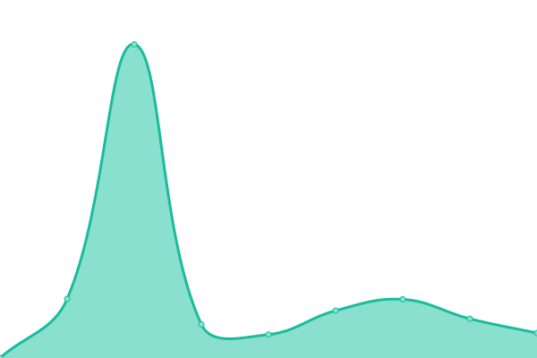

# [📈 Live Status](https://status.creatrip.com): <!--live status--> **🟩 All systems operational**

<!--start: status pages-->
<!-- This summary is generated by Upptime (https://github.com/upptime/upptime) -->
<!-- Do not edit this manually, your changes will be overwritten -->
<!-- prettier-ignore -->
| URL | Status | History | Response Time | Uptime |
| --- | ------ | ------- | ------------- | ------ |
|  [Creatrip Service Website (https://creatrip.com)](https://creatrip.com) | 🟩 Up | [creatrip-service-website-https-creatrip-com.yml](https://github.com/creatrip/status/commits/HEAD/history/creatrip-service-website-https-creatrip-com.yml) | 

 1168ms
     
 | 

<a href="https://status.creatrip.com/history/creatrip-service-website-https-creatrip-com">100.00%</a>
    

|  [Creatrip Service Website - Spot (https://creatrip.com/spot)](https://creatrip.com/spot) | 🟩 Up | [creatrip-service-website-spot-https-creatrip-com-spot.yml](https://github.com/creatrip/status/commits/HEAD/history/creatrip-service-website-spot-https-creatrip-com-spot.yml) | 

 5455ms
     
 | 

<a href="https://status.creatrip.com/history/creatrip-service-website-spot-https-creatrip-com-spot">100.00%</a>
    

|  [Creatrip Service Website - Stays (https://creatrip.com/stays)](https://creatrip.com/stays) | 🟩 Up | [creatrip-service-website-stays-https-creatrip-com-stays.yml](https://github.com/creatrip/status/commits/HEAD/history/creatrip-service-website-stays-https-creatrip-com-stays.yml) | 

 1016ms
     
 | 

<a href="https://status.creatrip.com/history/creatrip-service-website-stays-https-creatrip-com-stays">100.00%</a>
    

|  [Creatrip Service Website - Coupon (https://creatrip.com/coupon)](https://creatrip.com/coupon) | 🟩 Up | [creatrip-service-website-coupon-https-creatrip-com-coupon.yml](https://github.com/creatrip/status/commits/HEAD/history/creatrip-service-website-coupon-https-creatrip-com-coupon.yml) | 

 4234ms
     
 | 

<a href="https://status.creatrip.com/history/creatrip-service-website-coupon-https-creatrip-com-coupon">100.00%</a>
    

|  [Creatrip Service Website - Blog (https://creatrip.com/blog)](https://creatrip.com/blog) | 🟩 Up | [creatrip-service-website-blog-https-creatrip-com-blog.yml](https://github.com/creatrip/status/commits/HEAD/history/creatrip-service-website-blog-https-creatrip-com-blog.yml) | 

 2496ms
     
 | 

<a href="https://status.creatrip.com/history/creatrip-service-website-blog-https-creatrip-com-blog">100.00%</a>
    

|  [Creatrip Service Website - UserBlog (https://creatrip.com/userblog/travel)](https://creatrip.com/userblog/travel) | 🟩 Up | [creatrip-service-website-user-blog-https-creatrip-com-userblog-travel.yml](https://github.com/creatrip/status/commits/HEAD/history/creatrip-service-website-user-blog-https-creatrip-com-userblog-travel.yml) | 

 1287ms
     
 | 

<a href="https://status.creatrip.com/history/creatrip-service-website-user-blog-https-creatrip-com-userblog-travel">100.00%</a>
    

|  [Creatrip Service Website - Tips (https://creatrip.com/tips)](https://creatrip.com/tips) | 🟩 Up | [creatrip-service-website-tips-https-creatrip-com-tips.yml](https://github.com/creatrip/status/commits/HEAD/history/creatrip-service-website-tips-https-creatrip-com-tips.yml) | 

 1062ms
     
 | 

<a href="https://status.creatrip.com/history/creatrip-service-website-tips-https-creatrip-com-tips">100.00%</a>
    

|  [Creatrip Service Website - Proxy (https://creatrip.com/purchase)](https://creatrip.com/purchase) | 🟩 Up | [creatrip-service-website-proxy-https-creatrip-com-purchase.yml](https://github.com/creatrip/status/commits/HEAD/history/creatrip-service-website-proxy-https-creatrip-com-purchase.yml) | 

 1848ms
     
 | 

<a href="https://status.creatrip.com/history/creatrip-service-website-proxy-https-creatrip-com-purchase">100.00%</a>
    

|  [Creatrip Service Website - Proxy Sale (https://creatrip.com/purchase/sale)](https://creatrip.com/purchase/sale) | 🟩 Up | [creatrip-service-website-proxy-sale-https-creatrip-com-purchase-sale.yml](https://github.com/creatrip/status/commits/HEAD/history/creatrip-service-website-proxy-sale-https-creatrip-com-purchase-sale.yml) | 

 1420ms
     
 | 

<a href="https://status.creatrip.com/history/creatrip-service-website-proxy-sale-https-creatrip-com-purchase-sale">100.00%</a>
    

|  [Creatrip Service Website - Proxy List (https://creatrip.com/purchase/list)](https://creatrip.com/purchase/list) | 🟩 Up | [creatrip-service-website-proxy-list-https-creatrip-com-purchase-list.yml](https://github.com/creatrip/status/commits/HEAD/history/creatrip-service-website-proxy-list-https-creatrip-com-purchase-list.yml) | 

 1627ms
     
 | 

<a href="https://status.creatrip.com/history/creatrip-service-website-proxy-list-https-creatrip-com-purchase-list">100.00%</a>
    

|  [Creatrip Service Website - Proxy New (https://creatrip.com/purchase/new)](https://creatrip.com/purchase/new) | 🟩 Up | [creatrip-service-website-proxy-new-https-creatrip-com-purchase-new.yml](https://github.com/creatrip/status/commits/HEAD/history/creatrip-service-website-proxy-new-https-creatrip-com-purchase-new.yml) | 

 1384ms
     
 | 

<a href="https://status.creatrip.com/history/creatrip-service-website-proxy-new-https-creatrip-com-purchase-new">100.00%</a>
    

|  [Creatrip Service Website - Proxy Event (https://creatrip.com/purchase/event)](https://creatrip.com/purchase/event) | 🟩 Up | [creatrip-service-website-proxy-event-https-creatrip-com-purchase-event.yml](https://github.com/creatrip/status/commits/HEAD/history/creatrip-service-website-proxy-event-https-creatrip-com-purchase-event.yml) | 

 1089ms
     
 | 

<a href="https://status.creatrip.com/history/creatrip-service-website-proxy-event-https-creatrip-com-purchase-event">100.00%</a>
    

|  [Creatrip Service Website - Proxy Article (https://creatrip.com/purchase/article)](https://creatrip.com/purchase/article) | 🟩 Up | [creatrip-service-website-proxy-article-https-creatrip-com-purchase-article.yml](https://github.com/creatrip/status/commits/HEAD/history/creatrip-service-website-proxy-article-https-creatrip-com-purchase-article.yml) | 

 1520ms
     
 | 

<a href="https://status.creatrip.com/history/creatrip-service-website-proxy-article-https-creatrip-com-purchase-article">100.00%</a>
    

|  [Creatrip Service Website - News (https://creatrip.com/news)](https://creatrip.com/news) | 🟩 Up | [creatrip-service-website-news-https-creatrip-com-news.yml](https://github.com/creatrip/status/commits/HEAD/history/creatrip-service-website-news-https-creatrip-com-news.yml) | 

 1374ms
     
 | 

<a href="https://status.creatrip.com/history/creatrip-service-website-news-https-creatrip-com-news">100.00%</a>
    

|  [Creatrip Service Website - Language School (https://creatrip.com/languagecourse)](https://creatrip.com/languagecourse) | 🟩 Up | [creatrip-service-website-language-school-https-creatrip-com-languagecourse.yml](https://github.com/creatrip/status/commits/HEAD/history/creatrip-service-website-language-school-https-creatrip-com-languagecourse.yml) | 

 1366ms
     
 | 

<a href="https://status.creatrip.com/history/creatrip-service-website-language-school-https-creatrip-com-languagecourse">100.00%</a>
    

|  [Creatrip Company Website (https://creatrip.co.kr)](https://creatrip.co.kr) | 🟩 Up | [creatrip-company-website-https-creatrip-co-kr.yml](https://github.com/creatrip/status/commits/HEAD/history/creatrip-company-website-https-creatrip-co-kr.yml) | 

 2343ms
     
 | 

<a href="https://status.creatrip.com/history/creatrip-company-website-https-creatrip-co-kr">100.00%</a>
    

<!--end: status pages-->

[**Visit our status website →**](https://status.creatrip.com)

## 📄 License

- Powered by: [Upptime](https://github.com/upptime/upptime)
- Code: [MIT](./LICENSE) © [Upptime](https://upptime.js.org)
- Data in the `./history` directory: [Open Database License](https://opendatacommons.org/licenses/odbl/1-0/)
